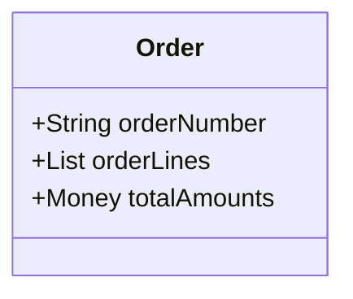

# 🔴 모메인 모델 시작하기

## 🟠 도메인

### 🟢 도메인이란?


예를 들어 온라인 서점 도메인은 소프트웨어로 해결하고자 하는 문제 영역, 즉 도메인에 해당한다.
한 도메인은 다시 하위 도메인으로 나눌 수 있다. 서점 도메인은 다음과 같이 나눌 수 있다.

### 🟢 도메인 전문가와 개발자 간 지식 공유

```
Garbage in, Garbage out
```

개발자는 고객이 원하는 요구사항을 분석하고 설계하여 코드를 작성하며 테스트하고 배포한다. 요구사항을 올바르게 이해하려면 어떻게 해야 하나? 여러 방법이 있겠지만 비교적 간단한 방법이 있다.

그것은 바로 개발자와 전문가가 직접 대화하는 것이다.

개발자와 전문가 사이에 내용을 전파하는 전달자가 많으면 많을수록 정보가 왜곡되고 손실이 발생하게 되며, 개발자는 최초에 고객이 요구한 것과는 다른 무언가를 만들게 된다.

## 🟠 도메인모델

### 🟢 도메인 모델


도메인 모델은 다음과 같이 객체 기반 주문 도메인 모델링이다.


상태 다이어그램으로 모델링할 수도 있다.

### 🟢 도메인 모델 패턴

| 구성 | 영역 | 설명 |
|-------|-------|-------|
| Presentation | 사용자 인터페이스 또는 표현 | 사용자의 요청을 처리하고 사용자에게 정보를 보여준다. 여기서 사용자는 client 이거나 외부 시스템일 수 있다. |
| Application | 응용 | 사용자가 요청한 기능을 실행한다. 서비스 로직을 직접 구현하지 않으며 도메인 계층을 조합해서 기능을 실행한다. |
| Domain | 도메인 | 시스템이 제공할 도메인 규칙을 구현한다. |
| Infrastructure | 인프라스트럭쳐 | DB나 Message Queue 같은 외부 시스템과의 연동을 처리한다. |

`개념 모델` 순수하게 문제를 분석하여 작성된 결과물이다. 

`구현 모델` 개념 모델을 작성하고 점진적으로 개선해 나가며 얻은 도메인 지식을 통해 발전시킨 모델이다.

### 🟢 도메인 모델 도출

```
최소 한 종류 이상의 상품을 주문해야 한다.
한 상품을 한 개 이상 주문할 수 있다.
총 주문 금액은 각 상품의 구매 가격 합을 모두 더한 금액이다.
각 상품의 구매 가격 합은 상품 가격에 구매 개수를 곱한 값이다.
주문할 때 배송지 정보를 반드시 지정해야 한다.
배송지 정보는 받는 사람 이름, 전화번호, 주소로 구성된다.
출고를 하면 배송지를 변경할 수 없다.
출고 전에 주문을 취소할 수 있다.
고객이 결제를 완료하기 전에는 상품을 준비하지 않는다.
```

다음과 같은 요구사항이 있을때 요구사항에 맞춰 도메인을 점진적으로 진화시키는 과정을 도메인 모델 도출이라 한다.

```
한 상품을 한 개 이상 주문할 수 있다.
각 상품의 구매 가격 합은 상품 가격에 구매 개수를 곱한 값이다.
```

다음 요구사항은 주문 항목이 어떤 데이터로 구성되는지 알려준다. 

두 요구사항에 따르면 OrderLine은 적어도 주문할 상품, 상품의 가격, 구매 개수를 포함하애 한다.

```
최소 한 종류 이상의 상푸을 주문해야 한다.
총 주문 금액은 각 상품의 구매 가격 합을 모두 더한 금액이다.
```

다음 요구사항은 Order와 OrderLine과의 관계를 알려준다.

한 종류 이상의 상품을 주문할 수 있으므로 Order는 최소 한 개 이상의 OrderLine을 포함해야 한다. 또한 총 주문 금액은 OrderLine에서 구할 수 있다.

이렇듯 요구사항들을 분석하여 초기 모델에서 점진적으로 모델을 구현해가는 것을 도메인 모델 도출 과정이라 한다.

## 🟠 엔티티와 밸류

### 🟢 엔티티와 밸류

`Entity` 가장 큰 특징으로는 식별자를 가진다는 것이다.



다음과 같이 orderNumber라는 식별자 값을 가진다.

db에 넣는 값이라면 자동 증가되는 id 값을 사용할 수 있다.

`Value`

```java
public class ShippingInfo {
    private String receiverName;
    private String receiverPhoneNumber;

    private String shippingAddress1;
    private String shippingAddress2;
    private String shippingZipcode;
}
```

다음과 같은 class가 존재할 때 위 두개의 receiverName, receiverPhoneNumber은 받는 사람에 대한 정보이고 shippingAddress1, shippingAddress2, shippingZipcode 값은 주소 정보이다. 이 정보를 Value로 분리해낼 수 있다.

```java
public class Receiver {
    private String name;
    private String phoneNumber;
}
```

```java
public class Address {
    private String address1;
    private String address2;
    private String zipcode;
}
```

밸류 객체에서 데이터를 변경할 때는 기존 데이터를 변경하지 않고 변경한 데이터를 갖는 새로운 밸류 객체로 생성하는 방식을 선호한다. immutable(불변) 객체로써 사용한다.

```java
public class Address {
    private String address1;
    private String address2;
    private String zipcode;

    public updateZipcode(String zipcode) {
        return new Address(this.address1, this.address2, zipcode);
    }
}
```

### 🟢 Dto

Dto는 프레젠테이션 계층과 도메인 계층이 데이터를 서로 주고받을 때 사용하는 일종의 구조체다. 예전에는 DB 컬럼 값을 설정할때 set이 필요하여 기술 구현을 위해 어쩔 수 없이 Dto에 get/set을 구현해야 했다. 

요즘 개발에서는 Dto 또한 set을 사용하지 않고 불변 객체로써의 장점을 사용하기 위해 적용하여 사용한다.

## 🟠 도메인 용어

### 🟢 도메인 용어와 유비쿼터스 언어

결제의 단계를 STEP1, STEP2, STEP3 라고 한다면 청므 보는 개발자가 이해하기 어려울 것이다. 이를 WAIT, DELIVERING, COMPLETE 와 같이 도메인 용어를 사용하여 처리하는 것이 필요하다.

에릭 에반스는 도메인 주도 설계에서 언어의 중요함을 강조하기 위해 유비쿼터스 언어(Ubiquitous language)를 사용했다. 전문가, 관계자, 개발자가 도메인과 관련된 공통의 언어를 만들고 이를 대화, 문서, 도메인 모델, 코드, 테스트 등 모든곳에서 같은 용어를 사용한다는 것이다.

알맞는 단어를 찾아내는 노력 또한 도메인 주도 개발로 다가가는 노력이다.