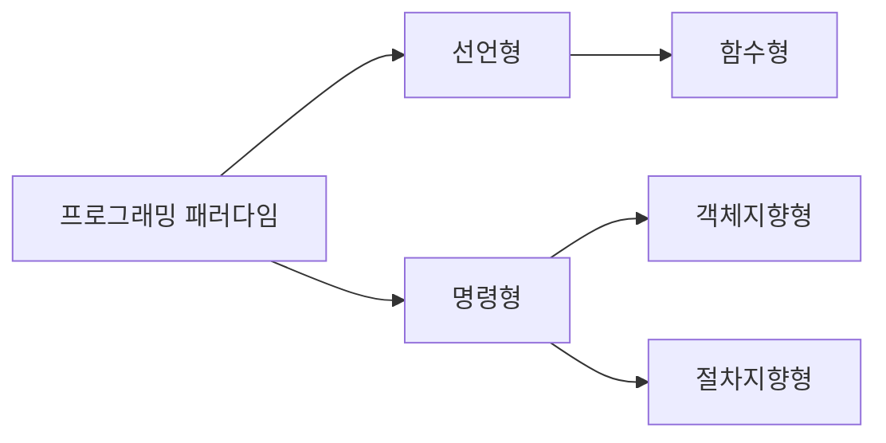

# 🔴 디자인 패턴과 프로그래밍 패러다임

## 🟠 디자인 패턴

### 🟢 싱글톤 패턴
하나의 클래스에 오직 하나의 인스턴스만 가지는 패턴이다. 자바에서 싱글톤을 유지하기 위해 내부적으로 syncronized를 통해 구현하거나 enum, eager initialization, Bill Pugh Solution을 통해 구현할 수 있다.

```java
public class Singleton {
    private static Singleton singletonObject;

    private Singleton() {
    }
    
    public static synchronized Singleton getInstance() {
        if (singletonObject == null) {
            singletonObject = new Singleton();
        }
        
        return singletonObject;
    }
}
```

synchronized를 사용하는 방법


```java
public class Singleton {
    private static final Singleton SINGLETON_OBJECT = new Singleton();

    private Singleton() {
    }

    public static Singleton getInstance() {
        return SINGLETON_OBJECT;
    }
}
```
이른 초기화를 통해 서버 시작시 객체를 미리 생성해서 사용하는 방법

```java
public class Singleton {

    private Singleton() {
    }

    private static class SingletonHolder {
        private static final Singleton INSTANCE = new Singleton();
    }

    public static Singleton getInstance() {
        return SingletonHolder.INSTANCE;
    }
}
```

중첩 클래스로 구현하여 JVM에서 ClassLoader에 의해서 로드될 때 내부적으로 실행되는 synchronized 키워드를 이용하는 방법, 하지만 이 또한 리플렉션에 의해 파괴될 수 있다.

```java
public enum Singleton {
    INSTANCE
}
```

가장 단순하고 안전한 코드 하지만 Enum 이외에는 상속하여 사용할 수 없다.

### 🟢 팩토리 패턴

객체를 사용하는 코드에서 객체 생성 부분을 떼어내 추상화한 패턴이자 상속 관계에 있는 두 클래스에서 상위 클래스가 중요한 뼈대를 결정하고, 하위 클래스에서 객체 생성에 관한 구체적인 내용을 경정하는 패턴이다.

```java
enum CoffeType {
    LATTE,
    AMERICANO,
}
```

```java
abstract class Coffee {
    protected String name;

    public String getName() {
        return name;
    }
}

class Latte extends Coffee {
    public Latte() {
        name = "Latte";
    }
}

class Americano extends Coffee {
    public Americano() {
        name = "Americano";
    }
}
```

```java
class CoffeeFactroy {
    public static Coffe createCoffee(CoffeeType type) {
        switch (type) {
            case LATTE:
                return new Latte();
            case AMERRICANO:
                return new Americano();
            default:
                return new IlleagalArgumentException("Invalid Coffee type");
        }
    }
}
```

```java
public class Main {
    public static void main(String[] args) {
        Coffee coffee = CoffeeFactory.createCoffee(CoffeeType.LATTE);
        System.out.println(coffee.getName());   // Latte
    }
}
```

Coffee라는 추상 클래스를 통해 하위 클래스를 구현하고 Factory를 통해 구현체를 선택하여 받을 수 있다.

### 🟢 전략 패턴

객체의 행위를 바꾸고 싶은 경우 직접 수정하지 않고 구현체를 바꾸어 적용하게 만드는 패턴이다.

```java
interface PaymentStrategy {
    void pay(int amount);
}

class KAKAOCardStrategy implements PaymentStrategy {
    private String name;
    private String cardNumber;
    private String cvv;
    private String dateOfExpiry;

    // 생성자

    @Override
    public void pay(int amount) {
        System.out.println(amount + " paid using KAKAO card");
    }
}

class LUNACardStrategy implements PaymentStrategy {
    private String email;
    private String password;

    // 생성자

    @Override
    public void pay(int amount) {
        System.out.println(amount + " paid using LUNA card");
    }
}
```

```java
class Item {
    private String name;
    private int price;
    //생성자

    public String getName() {
        return name;
    }

    public int getPrice() {
        return price;
    }
}

class ShoppingCart {
    List<Item> items;

    public ShoppingCart() {
        this.items = new ArrayList<Item>();
    }

    public void addItem(Item item) {
        this.times.add(item);
    }

    public void removeItem(Item item) {
        this.times.remove(item);
    }

    public int claculateTotal() {
        int sum = 0;
        for (Item item : items) {
            sum += item.getPrice();
        }
        return sum;
    }

    public void pay(PaymentStrategy strategy) {
        int amount = calculateTotal();
        strategy.pay(amount);
    }
}
```

```java
public class Main {
    public static void main(String[] args) {
        ShoppingCart cart = new ShoppingCart();
        cart.addItem(new Item("Laptop", 100000));
        cart.pay(new KAKAOCardStrategy("juno", "1234", "111", "12/10/2030"));
        cart.pay(new LUNACardStrategy("juno@mail.com", "1234"));
    }
}
```

PaymentStrategy의 구현체들로 카드 생성 로직을 준비한다. 그 후 ShoppingCart의 pay method에 입력되는 전략 class에 따라 카드 결제 방식을 바꿀 수 있게 하는 것이다.

### 🟢 옵저버 패턴

주체가 어떤 객체의 상태 변화를 관찰하다가 상태 변화가 있을 때마다 메서드 등을 통해 옵저버 목록에 있는 옵저버들에게 변화를 알려주는 디자인 패턴이다.

```java
interface Observer {
    void update();
}

class TopicSubscriber implements Observer {
    private String name;
    private Subject topic;

    // 생성자

    @Override
    public void update() {
        String message = (String) topic.getUpdate(this);
        System.out.println(name + " : " message);
    }
}
```

```java
interface Subject {
    void register(Observer observer);
    void unRegister(Observer observer);
    void notifyObservers();
    Object getUpdate(Observer observer);
}

class Topic implements Subject {
    private List<Observer> observers;
    private String message;

    public Topic() {
        this.observers = new ArrayList<Observer>();
        this.message = "";
    }

    @Override
    public void register(Observer observer) {
        if (!observers.contains(observer)) {
            observers.add(observer);
        }
    }

    @Override
    public void unRegister(Observer observer) {
        observers.remove(observer);
    }

    @Override
    public void notifyObservers() {
        for (Observer observer : observers) {
            observer.update();
        }
    }

    @Override
    public Object getUpdate(Observer observer) {
        return this.message;
    }

    public void postMessage(String message) {
        System.out.println("Message send to Topic : "+ message);
        this.message = message;
        notifyObservers();
    }
}
```

```java
public class Main {
    public static void main(String[] args) {
        Topic topic = new Topic();
        TopicSubscriber subscriber1 = new TopicSubscriber("subscriber1");
        TopicSubscriber subscriber2 = new TopicSubscriber("subscriber2");
        topic.register(subscriber1);
        topic.register(subscriber2);
        topic.postMessage("Hello World");
    }
}
```

topic의 변화를 대기하는 subscriber들로 Observer를 구현한 TopicSubscriber를 생성한다. 그리고 topic.register()를 통해 observer들을 추가해주고 postMessage 내부에서 notifyObersers()를 통해 전체 옵저버들의 update()를 실행시키는 구조이다.

이렇게 되면 topic에 대해 등록된 observer들은 postMessage()를 통해 실행될 때마다 전체 옵저버들이 변화를 감지하여 update()를 실행할 수 있는 구조가 된다.

여기서 구현(implelement)과 상속(extends)에 대해서도 구분을 한다면 

`상속`은 자식 클래스가 부모 클래스의 메서드 등을 상속받아 사용하며 자식 클래스에서 추가 및 확장을 할수 있게 하는 것이다. 이로 인해 재사용성, 중복성을 최소화할 수 있다. 하지만 상속을 통해 슈퍼 클래스를 만들고 해당 클래스를 여기저기서 상속하는 것은 좋지 않은 구조이다.

`구현`은 부모 interface를 자식 클래스에서 재정의하여 구현하는 것을 말하며, 상속과는 달리 반드시 부모 클래스의 메서드를 재정의하여 구현해야 한다.

### 🟢 프록시 패턴

대상 객체에 접근하기 전 그 접근에 대한 흐름을 가로채 해당 접근을 필터링하거나 수정하는 등의 역할을 하는 계층이 있는 디자인 패턴이다.

가장 많이 쓰이는 것이 프록시 서버로 활용되는 경우이며 대표적인 프록시 서버로는 nginx, CloudFlare와 같은 웹서버, CND 서비스가 있다.

여기서 CDN(Content Delivery Network)이란 전세계적으로 서비스를 할때 한국 서버에서 미국 서버까지 도달하는 시간이 있기 때문에 유저의 경험이 좋지 못하다. 하지만 이런 CDN 서비스를 통해 콘텐츠들을 미리 캐싱해두면 내용이 바뀌지 않는 한은 CDN 서버에 캐싱된 콘텐츠를 반환하도록 하여 유저의 사용 경험을 개선할 수 있다. 혹은 CloudFlare와 같이 중간 프록시 서버로써 CAPTCHA를 도입하여 DDos 공격을 방어하는 목적으로도 사용할 수 있다.

### 🟢 MVC 패턴

M(Model), V(View), C(Controller)로 이루어진 디자인 패턴이다.

애플리케이션의 구성을 3가지 역할로 구분하여 개발 프로세스에서 각각의 구성요소에만 집중해서 개발할 수 있다. 주로 Web 개발에 사용되며 Spring 구조가 대표적이다.

## 🟠 프로그래밍 패러다임

### 🟢 선언형과 함수형 프로그래밍



### 🟢 객체지향 프로그래밍

객체지향 프로그래밍은 객체들의 집합으로 프로그램의 상호 작용을 표한하며 데이터를 객체로 취급하여 객체 내부에 선언된 메서드를 활용하는 방식이다.

객체지향 프로그래밍은 추상화, 캡슐화, 상속, 다형성이라는 특징이 있다.

`추상화(abstraction)`란 복잡한 시스템에서 핵심적인 개념 또는 기능을 간추려낸 것이다.

`캡슐화(encapsulation)`란 객체의 속성과 메서드를 하나로 묶고 외부에 감추어 은닉하는 것을 말한다.

`상속성(inheritance)`이란 상위 클래스의 특성을 하위 클래스가 이어받아서 재사용하거나 추가, 확장하는 것이다.

`다형성(polymorphism)`이란 하나의 메서드나 클래스가 다양한 방법으로 동작하는 것을 말한다.

---

또한 객체지향의 설계원칙으로는 SOLID 원칙이 존재한다.

`SRP(Single Responsibility Principle)`란 모든 클래스는 단 하나의 책임만 가져야 한다.

`OCP(Open Closed Principle)` 유지 보수 사항이 생긴다면 코드를 쉽게 확장할 수 있도록 하고 수정할때는 해당 코드만 수정하도록 닫혀있어야 한다는 것이다.

`LSP(Liskov Substitution Principle)` 프로그램의 정확성을 깨드리지 않으면서 하위 타입의 인스턴스로 바꿀 수 있어야 한다는 것이다. 클래스를 상속했을 때 부모, 자식 관계가 형성된다. 이때 부모 객체 대신 자식 객체로 변경해도 시스템이 문제 없이 돌아가야 한다는 것이다.

`ISP(Interface Segregation Principle)` 하나의 일반적인 인터페이스보다 구체적인 여러개의 인터페이스를 작성해야 한다.

`DIP(Dependency Inversion Principle)` 자신보다 변하기 쉬운것에 의존하던 것을 추상화된 인터페이스나 상위 클래스를 두어 변하기 쉬운 것에 변화에 영향을 받지 않게 하는 원칙이다. 

### 🟢 절차형 프로그래밍

일이 진행되는 순서대로 코드를 구현하였기에 코드의 가독성도 좋으며 실행이 빠릅니다. 하지만 모듈화가 어렵고 유지 보수성이 떨어지기 때문에 복잡한 수학 연산이다 과학 예측, 머신 러닝 작업등에 활용된다.
