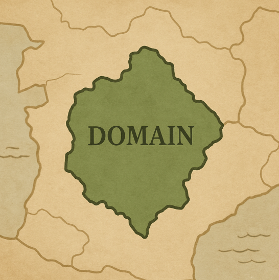

`출처` [토비의 클린 스프링 - 도메인 모델 패턴과 헥사고날 아키텍처 part 1](https://www.inflearn.com/course/%ED%86%A0%EB%B9%84-%ED%81%B4%EB%A6%B0%EC%8A%A4%ED%94%84%EB%A7%81-%EB%8F%84%EB%A9%94%EC%9D%B8%EB%AA%A8%EB%8D%B8%ED%8C%A8%ED%84%B4-%ED%97%A5%EC%82%AC%EA%B3%A0%EB%82%A0-part1/dashboard)

# 🔴 도메인 모델이 이끄는 개발

## 🟠 Domain

### 🟢 도메인이란?

도메인의 사전적인 의미는 영토, 영역, 소유지이다.

개발에서 사용되는 의미는 지식, 영향, 활동 영역으로도 통한다.

### 🟢 개발자에게 도메인

개발자로서 도메인은 클라이언트들의 직접적인 관심사이고 개발하는 서비스의 주제가 된다.

### 🟢 도메인 모델

핵심 개념과 요소들을 통합하고, 그 관계를 정확하게 구현해야 한다. 

개념들 사이의 관계, 그리고 규칙을 코드로서 표현해야 하는 것이다.

### 🟢 DDD

도메인을 구현하는 것은 매우 복잡하다. 복잡하게 얽혀지는 문제들을 해결하기 위한 개발 방법론이다.

도메인을 개발의 중심으로 보고 개발하며 모든 팀원(개발자 뿐만 아니라 도메인 전문가, 실무자 등 모든 인원)이 함께 참여하고 발전시켜 나가는 방법이다.

팀에서 도메인 모델에 기반한 단일 어휘체계(유비쿼터스 언어)를 만들고, 이를 문서, 회의, 대화, 코드 등 모든 영역에서 일관되게 사용한다. (보편 언어)

하지만 아쉽게도 이번 강의에서는 DDD를 적용하지 않으신다고 한다...ㅜ 이거 보려고 결제 했습니다...ㅜㅜㅜ 그래도 다행히 개발을 진행하며 DDD 원칙을 최대한 지키며 진행하신다고 하니 끝까지 봐보자!

### 🟢 DDD를 위한 기록

1. 용어사전
2. 도메인 정리
3. 도메인 그림

기존에 사용되는 문서 말고도 용어사전과 모메인에 대한 개념 정리, 관계를 그림으로 표현하는 문서를 추가로 작성하자

### 🟢 기록하는 방법

1. 듣고 배우기
2. 중요한것들 찾기(개념 식별)
3. 연결고리 찾기(관계 정의)
4. 것들을 설명하기(속성 및 기본 행위 명시)
5. 그려보기(시각화)
6. 이야기하고 다듬기(반복)

위 행동들을 통하면 도메인에 대한 정리와 관계를 정리하는데 도움이 될것이다.

### 🟢 도메인 전문가가 없다면?

위에서 모든 팀원이라는 부분에 도메인 전문가가 포함되어 있다. 하지만 세상에 없던 프로젝트나 소규모 업체라 도메인 전문가 없이 개발자들로만 구성되어 있는 팀도 있을 수 있다.

이런 경우는 도메인 전문가 대신 모두가 도메인 전문가가 되는 방법이 있다. 기획자, PO, CEO, 개발자 모두가 도메인에 대해 공부하고 모두가 전문가가 되어서 서로의 의견을 주고 받으며 탐색과 학습을 진행하는 것이다.

그리고 경쟁 업체를 분석하는 방법도 있다. 쇼핑몰을 만든다면 네이버 쇼핑, 쿠팡, G마켓 등 다른 업체들의 구조를 파악하고 주제를 파악하여 반영하는 것이다.