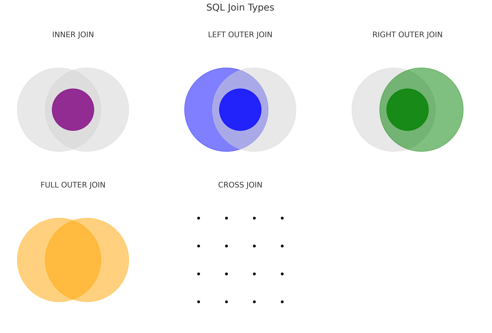

# 🔴 1차 면접 (30분)

## 🟠 질문

0. 자개소개
```text
준비해간 것 완료
```

1. 가장 기억에 남거나 최근에 진행한 프로젝트는 무엇인가요?
```text
OOM 문제 해결 프로젝트 말함
```

2. OOM 문제 해결을 진행한 과정을 설명해주세요.
```text
JVM 옵션에 있어서 heap dump 파일 jmap 파일을 얻을 수 있었고 intellij를 통해 분석했다.
메모리 사용량이 가장 큰 객체부터 의심하여 진행하였고 프로젝트가 정상적으로 돌아가다가 갑자기 안된거여서 깃 로그를 통해
최근에 수정된 객체를 위주로 의심하여 LinkedBlockingQueue를 의심하였고 해당 자료구조의 경우 기본 생성자로 생성시 논리적 크기가 21억이라
저희쪽 로직 특성상 insert는 병렬로 진행하고 read는 단일 스레드로 진행되어서 속도차이로 인해 데이터가 쌓여 터진 구조였다.
그 구조 해결을 위해 케파를 설정하였고 내부적으로 케파 이상 데이터가 들어가려고 할때 await을 해주는 부분이 존재하여
성능은 조금 아쉬워졌지만 안정성을 올린 trade off 경험이였다.
```

3. web server와 was(web application server)를 아시나요?
```text
web server는 nginx나 tomcat 같은 로드밸런싱이나 정적인 화면을 전달하는 곳
was는 web application 서버로 로직을 처리하는 곳
```

4. web server 사용해보신게 있나요?
```text
tomcat과 nginx를 사용해보았습니다.
```

5. left outer join과 full outer join에 대해 설명해주세요.
```text
갑자기 생각 안나서 대답 못함;
mysql에서만 써서 join 명칭이 생각이 안났음.
```



-> left outer join = left join, full outer join = union

6. 팀에서 개발자 구성은 어떻게 되어 있나요?
```text
저까지 포함해서 총 10명이고 서버 9명, 프론트 1명임.
앱팀은 10명 따로 있음.
```
-> 개발자가 엄청 많다며 놀라워함

6. redis 캐시 무효화 전략에 대해 설명해주실 수 있냐? 
```text
캐시 무효화 전략에 대해 외우고 있진 않아서 제가 적용한 무효화 전략에 대해서 설명 드려도 될지 물어보고 캐시 정해진 규칙의 키를 정의하고
해당 부분에 대해 데이터 변경이 일어날 경우 데이터를 교체하는 방식으로 진행했다고 설명함
```

-> 캐시를 관리하는 전략 중 하나로 캐시 무효화 전략을 사용한 것이라 캐시 무효화 전략에 종류가 있다고 생각하지 않고 있었어서 캐시 무효화전략에 대해서만 설명함, write-through, write-around, write-back 등의 전략도 있네 write-through 전략이 내가 진행한 방법일듯

7. 일할때 워킹데이보다 늦게 끝내 본적이 있나? 
```text
대부분 워킹데이보다 늦어본 적이 없고 만약 워킹데이보다 일이 더 오래 걸릴것 같으면 야근을 하면서라도 맞추려고 했다고 함 
하지만 워킹데이를 맞추지 못해 야근을 한 경험은 많지 않다고 설명
```

8. 일을 진행할때 다른팀과는 어떻게 협업 했냐
```text
기획에서 좋은 기획은 많이 해오지만 해당 기능이 우리쪽 기존 로직과 데이터를 적재함에 있어 문제가 없을지 판단한다.
뿐만 아니라 앱팀에서도 로직이 있기 때문에 해당 부분이 앱팀에서도 구현이 가능한 부분인지 함께 커뮤니케이션 하며 진행하려고 한다.
```

9. 에자일, 레인보우 폴 방식 중 어떤 방식으로 진행했냐
```text
현재 회사는 에자일로 진행하고 있다고 함
```

10. 안랩에 궁금한게 있나요?
```text
현재 프로젝트들이 많고 기술도 다양하던데 개선해가고 있는 과정인가 궁금하다고 물어봄
```
->
```text
현재 계획은 없지만 앞으로 그렇게 진행해야될 부분이라고 생각한다고 말함 -> 옆에 실무 개발자는 계속 고래를 절레 절레 흔듬 아마 개선을 안하고 운영만 하는게 목적인듯 함
```

11. 또 궁금한게 있나?
```text
내 이력서에서 좋았던 부분이 어떤 부분이였는지 궁금하다. 물어봄
-> 앞으로는 이렇게 물어보지 말고 좋은 개발자는 어떤 개발자인가 물어봐야겠음
```

-> 
```text
우선 지금 팀이 인프라부터 백엔드, 프론트까지 모두 진행해야되는 팀인데 이력서상에 데브옵스까지 경험했던 이력이 좋았음
```

---

종료 -> 1차 면접 최종 탈락

헤드헌터와 얘기해보았을 때 안랩은 개선을 좋아하지 않는 곳이라고 함. 이렇게 대답한 경우 대부분 탈락할 수 있다고 조언해줌.